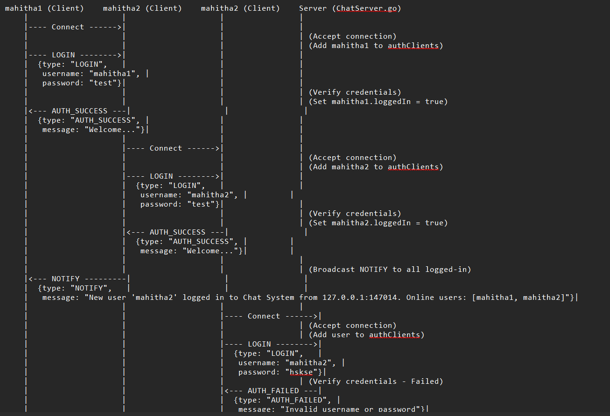
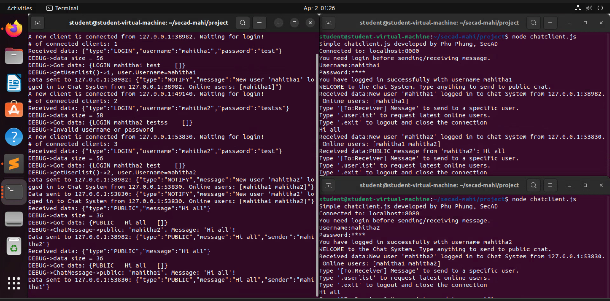
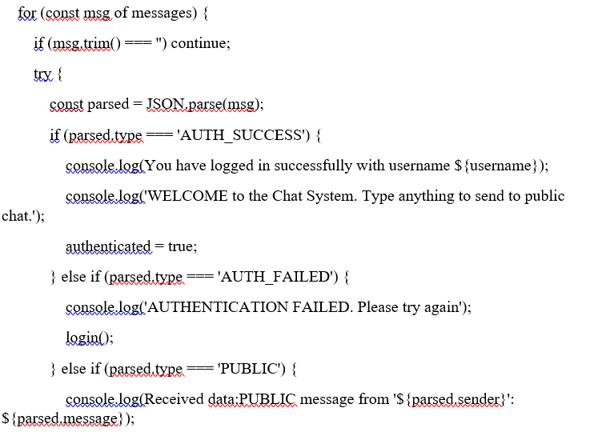
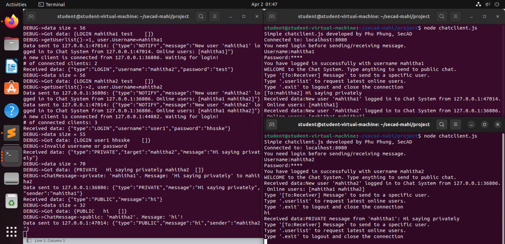

# 💬 Secure-Talk: Concurrent Real-Time Chat System

## 📌 Overview
Secure-Talk is a robust, multi-user communication system designed for high performance and secure message handling. It features a backend server built in **Go** to handle massive concurrency and an interactive **Node.js** client for a seamless user experience.

## 🛡️ Security Impact & Outcomes
Focus: Resilience & Protocol Integrity
Outcome:
* Improved System Availability and Uptime by utilizing Go’s concurrency model (Goroutines) to prevent server crashes under high-traffic, multi-user loads.
* Prevented Unauthorized Interception of communication by designing a custom JSON-handshake protocol that rejects unauthenticated TCP connections.
*  Optimized Resource Efficiency, allowing the server to handle hundreds of concurrent clients with minimal CPU and memory overhead compared to traditional threading.

## ⚡ Technical Highlights
* **Go Concurrency:** Utilizes **Goroutines** and **Channels** to handle hundreds of simultaneous TCP connections with minimal memory overhead.
* **Custom JSON Protocol:** Designed a structured communication protocol to handle `LOGIN`, `PUBLIC`, `PRIVATE`, and `USERLIST` message types.
* **Secure Authentication:** Access is restricted to authenticated users. The server maintains a dynamic `authClients` list to manage sessions.
* **Real-time Synchronization:** State changes (users joining/leaving) are broadcasted instantly to all active clients.

## 🛠️ Tech Stack
* **Server-Side:** Golang (Standard `net` and `bufio` packages)
* **Client-Side:** Node.js (Readline and Net modules)
* **Protocol:** TCP with JSON payload serialization

## 📸 System Previews

| **System Architecture** | **Multi-User Concurrency** |
|:---:|:---:|
|  |  |

| **Authentication Logic** | **Private Messaging** |
|:---:|:---:|
|  |  |

## 📂 Structure
* `/server`: Go source code for the TCP server logic.
* `/client`: Node.js client-side interactive interface.
* `Secure_Chat_Technical_Report.pdf`: Detailed architecture and testing documentation.

---
*Developed as part of the Secure Application Development (SECAD) curriculum at the University of Dayton.*
